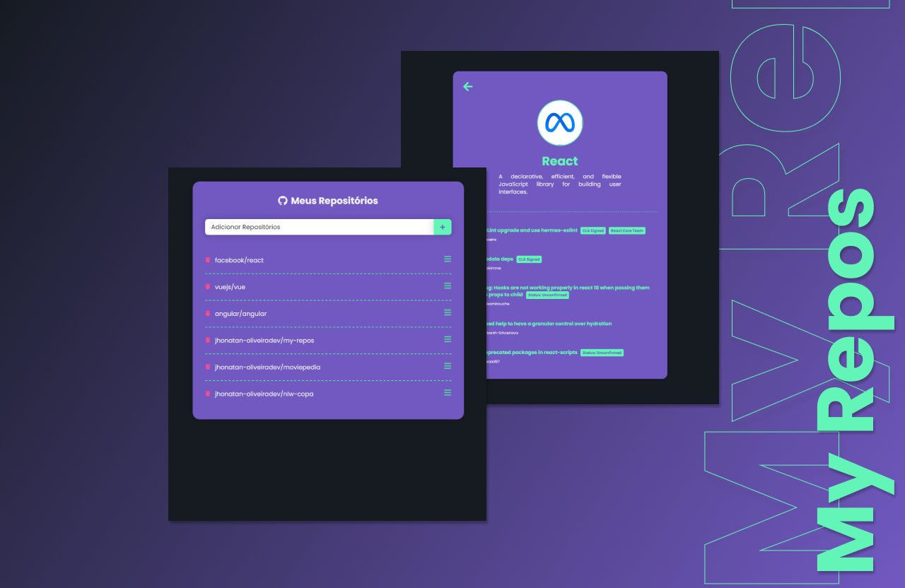

<div align="center">
<h1 align="center">My Repos | Save your favorites repositories.<br> made with React. ⚛</h1>
</div>

<p align="center">
  <a href="#-tecnologias">Tecnologies</a>&nbsp;&nbsp;&nbsp;|&nbsp;&nbsp;&nbsp;
  <a href="#-projeto">Project</a>&nbsp;&nbsp;&nbsp;|&nbsp;&nbsp;&nbsp;
  <a href="#memo-licença">License</a>
</p>

<p align="center">
 
  
  
</p>

<p align="center">
    
</p>

<br>

<p align="center">
  
</p>

# 📄 Description:

### What is My Repos? 🤔

- A project made with React that allows you to save your favorite repositories on Github. 🚀

# 🚀 Tecnologies:

This project was developed with the following technologies:

### React 📝

### react-router-dom 📝

### JavaScript 📝

### react-icons 📝

### axios 📝

### Github API 📝

### Styled Components 💅

How to run:

```bash

# Clone Repository

$ git clone

# Go to folder

$ cd my-repos

# Install Dependencies

$ npm install

# Run Aplication

$ npm start

```

Go to http://localhost:3000/ to see the result.

# 🚧 Project:

### [Live project!](https://my-repos.vercel.app/) 🚀

# 🎨 Prototype:

### [Figma File](https://www.figma.com/file/yXobc19EQdM8bpskMHMHv0/my-repos?node-id=1%3A7&t=GSRqWn8yET75Y18i-1) 🚀

# 📝 License:

This project is under the MIT license. See the [LICENSE](LICENSE.md) for more information.

<hr>

<p align="center">Made by <a href="https://wwwjhonatan.oliveira.com/" target="_blank">Jhonatan Oliveira</a>.</p>
